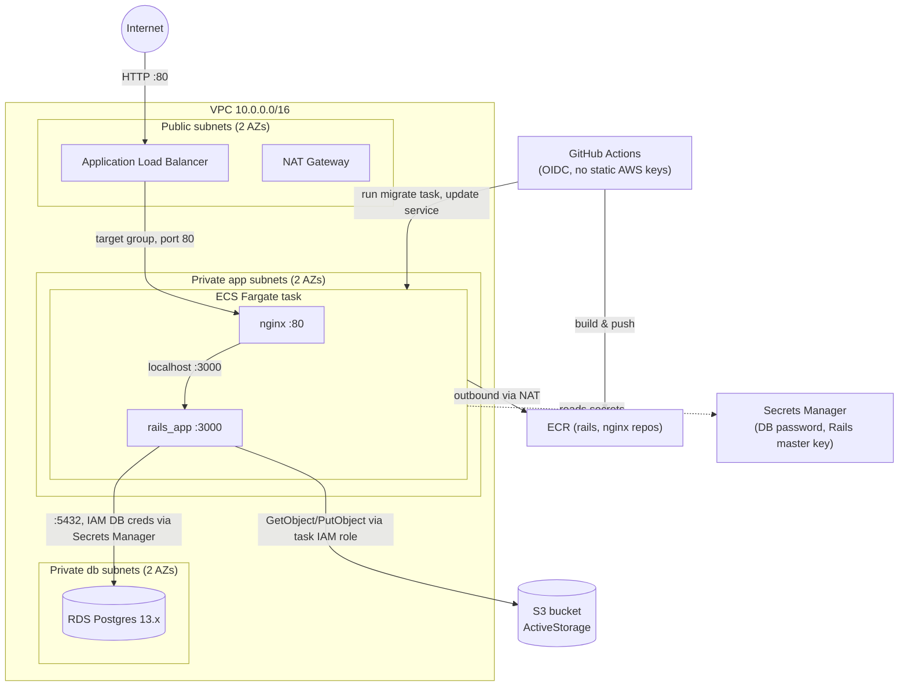

# Infrastructure: Ruby on Rails on ECS Fargate

Terraform that provisions a scalable, production-shaped AWS environment for the
Dockerized Rails + Nginx app in this repo: a dedicated VPC, an internet-facing
ALB, an ECS Fargate service running in private subnets, an RDS Postgres
instance, and an S3 bucket for ActiveStorage — plus a GitHub Actions pipeline
that builds images, pushes them to ECR, runs migrations, and deploys.

**Status: deployed and verified working end-to-end** — ALB → nginx → Rails →
RDS/S3, CI/CD via GitHub Actions OIDC, `HTTP 200` with both ECS tasks
`healthy` in the target group. See [`TROUBLESHOOTING.md`](TROUBLESHOOTING.md)
for the 13 issues hit getting there and how each was diagnosed and fixed —
useful both as a record and as a guide if you redeploy this into a different
AWS account/region and hit the same environment-specific snags (e.g. #1,
Postgres 13.3 availability).

## Architecture



**Why this shape:**

- **Only the ALB is public.** ECS tasks sit in private app subnets with no
  public IP; RDS sits in separate private db subnets with no route to the
  internet at all. Security groups are chained ALB → ECS tasks → RDS, each
  only accepting traffic from the tier in front of it.
- **ECS Fargate, not EC2/EKS.** No nodes to patch or size; the assignment's
  own emphasis on ECS/EKS + ELB is satisfied with less operational surface
  area than standing up a Kubernetes control plane for a single service.
- **S3 access is via the ECS task's IAM role**, not access keys — the
  `aws-sdk-s3` gem picks up credentials from ECS's container credentials
  endpoint automatically once `config/storage.yml` has no
  `access_key_id`/`secret_access_key` (see the app-side changes below).
- **RDS credentials are database credentials** (host/name/user/password) as
  required, with the password auto-generated and stored in Secrets Manager
  by RDS itself (`manage_master_user_password`) rather than living in
  `terraform.tfvars` or state in plaintext.
- **GitHub Actions authenticates via OIDC**, not long-lived AWS access keys
  stored as repo secrets.
- **Terraform and CI have a clean ownership split.** Terraform provisions the
  cluster, service, security groups, and the *shape* of the task definitions;
  it does not fight CI for control of which task-definition revision is
  live (`lifecycle.ignore_changes = [task_definition]` on the service) — CI
  registers new revisions and deploys them after the initial bootstrap. See
  [`TROUBLESHOOTING.md` #10](TROUBLESHOOTING.md#10-terraform-apply-silently-reverted-a-live-deploy-back-to-the-broken-revision)
  for what happens without this.
- **A deployment circuit breaker** (`deployment_circuit_breaker { enable =
  true, rollback = true }`) means a deployment that can never reach steady
  state (bad image, crashing container) rolls back automatically instead of
  retrying forever.

## App-side changes made to support this deployment

The forked repo's Docker/Rails setup assumed a docker-compose bridge network
(containers reach each other by container name). These changes were needed
for Fargate's `awsvpc` mode, where sibling containers in a task share one
network namespace and talk over `localhost`, plus a couple of Rails
production-hardening defaults that don't play well with ALB/container health
checks out of the box:

1. **`docker/nginx/default.conf` → `default.conf.template`**, using nginx's
   built-in envsubst templating so the same image works in both contexts:
   `RAILS_UPSTREAM=rails_app` for docker-compose (default in the Dockerfile),
   overridden to `RAILS_UPSTREAM=127.0.0.1` in the ECS task definition (the
   ECS side of this is easy to forget — see
   [`TROUBLESHOOTING.md` #12](TROUBLESHOOTING.md#12-deployment-circuit-breaker-fired-for-real-tasks-failed-to-start)).
2. **`config/storage.yml`**: dropped `access_key_id`/`secret_access_key` from
   the `amazon` service so the AWS SDK falls back to the task role.
3. **`config/environments/production.rb`**:
   - `config.active_storage.service` changed from `:local` to `:amazon`.
   - `config.hosts` now also allows `localhost` (the container's own Docker
     health check hits `http://localhost:3000/` directly) and any IP within
     `VPC_CIDR` (the ALB's health check, with `target_type = "ip"`, sends the
     target's raw private IP as the `Host` header, not the LB DNS name).
     Both were being blocked with 403s by `HostAuthorization` — see
     [`TROUBLESHOOTING.md` #9](TROUBLESHOOTING.md#9-rails-container-unhealthy-docker-health-check)
     and [#13](TROUBLESHOOTING.md#13-ecs-reported-tasks-healthy-alb-target-group-still-showed-them-unhealthy).
4. **`docker/app/entrypoint.sh`**: migrations (`db:create`, `db:schema:load`,
   `db:migrate`) now run only when `RUN_DB_MIGRATIONS=true`, so they happen
   once via a dedicated one-shot ECS task instead of racing across every
   service replica on every deploy. `rails_app.env` sets this back to `true`
   for local docker-compose, which only ever runs one replica. The migrate
   task also sets `DISABLE_DATABASE_ENVIRONMENT_CHECK=1`, since Rails treats
   `db:schema:load` as a destructive action and refuses to run it against
   `RAILS_ENV=production` otherwise, even on a brand-new database.

Also worth knowing: in the original docker-compose setup nginx and rails_app
are separate containers/images with no shared volume for `/public`, so nginx
can never actually serve precompiled assets itself — every request falls
through to the Rails proxy regardless. `RAILS_SERVE_STATIC_FILES=true` is set
on the Rails container so it serves its own assets rather than 404ing.

## Terraform layout

```
infrastructure/
├── main.tf, variables.tf, outputs.tf, versions.tf
├── terraform.tfvars.example
└── modules/
    ├── vpc/               # VPC, public/private-app/private-db subnets, IGW, NAT
    ├── ecr/                # rails + nginx repositories, lifecycle policy, scan-on-push
    ├── security_groups/    # ALB -> ECS tasks -> RDS chain
    ├── alb/                # internet-facing ALB, target group (IP targets), HTTP listener
    ├── s3/                 # ActiveStorage bucket, private + versioned + encrypted
    ├── rds/                 # Postgres 13.3, Secrets-Manager-managed password
    ├── iam/                 # task execution role, task role (S3 access), GitHub OIDC deploy role
    └── ecs/                 # cluster, "app" + "migrate" task defs, service, autoscaling
```

## Prerequisites

- Terraform >= 1.5, AWS CLI v2, an AWS account/credentials with permission to
  create VPC/ECS/RDS/S3/IAM/ECR/Secrets Manager resources.
- Docker, to build images locally if you want to test before pushing (CI
  builds them too).
- You've forked this repo to your own GitHub account.

## Deploy steps

1. **Configure variables.**
   ```bash
   cd infrastructure
   cp terraform.tfvars.example terraform.tfvars
   ```
   Fill in `terraform.tfvars`:
   - `s3_bucket_name` — must be globally unique (e.g. include your account ID).
   - `rails_master_key` — the contents of `config/master.key` from the repo
     root (decrypts `config/credentials.yml.enc`; needed for Rails'
     `secret_key_base` in production).
   - `github_org` / `github_repo` — your fork, used to scope the OIDC trust
     policy so only workflows running in *your* fork can assume the deploy role.

2. **Provision the infrastructure.**
   ```bash
   terraform init
   terraform plan
   terraform apply
   ```
   The ECS service will come up with 0 healthy tasks at first — the ECR
   repositories are empty until CI pushes an image. That's expected.

3. **Wire up GitHub Actions.** Print the values CI needs:
   ```bash
   terraform output github_actions_setup_summary
   ```
   In your fork: **Settings → Secrets and variables → Actions → Variables**,
   add each key/value from that output (`AWS_REGION`, `AWS_ROLE_ARN`,
   `ECR_RAILS_REPOSITORY`, `ECR_NGINX_REPOSITORY`, `ECS_CLUSTER`,
   `ECS_SERVICE`, `ECS_APP_TASK_FAMILY`, `ECS_MIGRATE_TASK_FAMILY`,
   `ECS_SUBNETS`, `ECS_SECURITY_GROUP`). No AWS secrets needed — auth is OIDC.

4. **Trigger the pipeline.** Push to `main` (or run the `Build, Push and
   Deploy` workflow manually from the Actions tab). It builds both images,
   pushes to ECR, registers new task definitions, runs the one-shot
   `migrate` task and waits for it to exit 0, then updates the ECS service
   and waits for it to stabilize.

5. **Verify.**
   ```bash
   terraform output application_url
   ```
   Open it in a browser — you should see the Rails `posts#index` page.
   `terraform output` also has `rds_address`, `s3_bucket_name`, etc. if you
   want to inspect individual resources.

## Scaling and availability

- ECS service runs `desired_count = 2` across 2 AZs behind the ALB, with
  target-tracking autoscaling on CPU (min 2, max 4, target 70%).
- `single_nat_gateway = true` by default (one NAT gateway, cheaper). Set it
  to `false` for one NAT per AZ if you want AZ-independent egress in
  production.
- `db_multi_az = false` by default. Set `true` for a synchronous standby.

## Security notes / production follow-ups

- No HTTPS listener is configured since there's no custom domain here — for
  production, add an ACM cert + Route 53 record and an HTTPS listener on the
  ALB (redirect 80 → 443).
- `db_deletion_protection` and `db_skip_final_snapshot` default to
  demo-friendly values (`false`/`true`). Flip both for production so
  `terraform destroy` can't silently drop the database.
- `config/master.key` is committed in the app repo (pre-existing in the
  assignment repo, not introduced here). It's still baked into the Rails
  image at build time; in production, prefer supplying `RAILS_MASTER_KEY`
  only via Secrets Manager (already wired up here) and stop shipping the key
  in the image/git history.
- Consider a remote Terraform backend (S3 + DynamoDB lock table) instead of
  local state for anything beyond a one-off demo.

## Cleanup

```bash
terraform destroy
```
Note `s3_bucket_name`'s bucket isn't force-emptied automatically — if it has
objects in it, empty it first (`aws s3 rm s3://<bucket> --recursive`) or the
destroy will fail on that resource.
